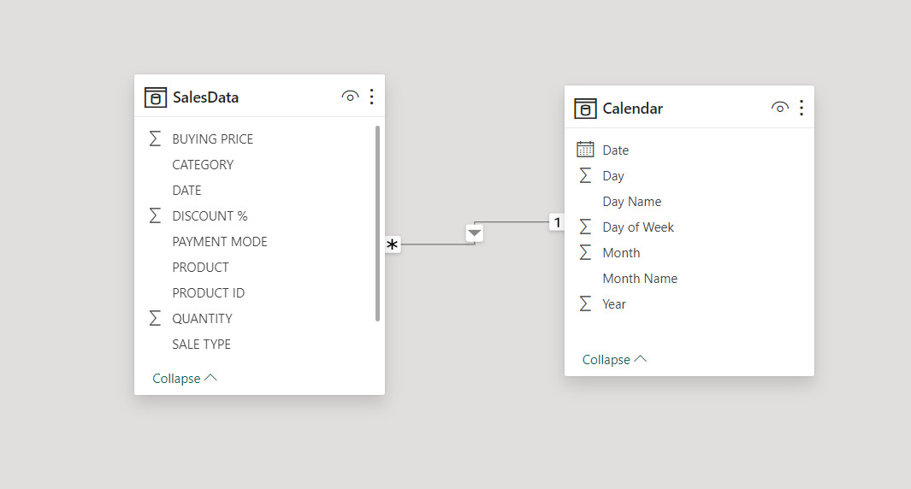
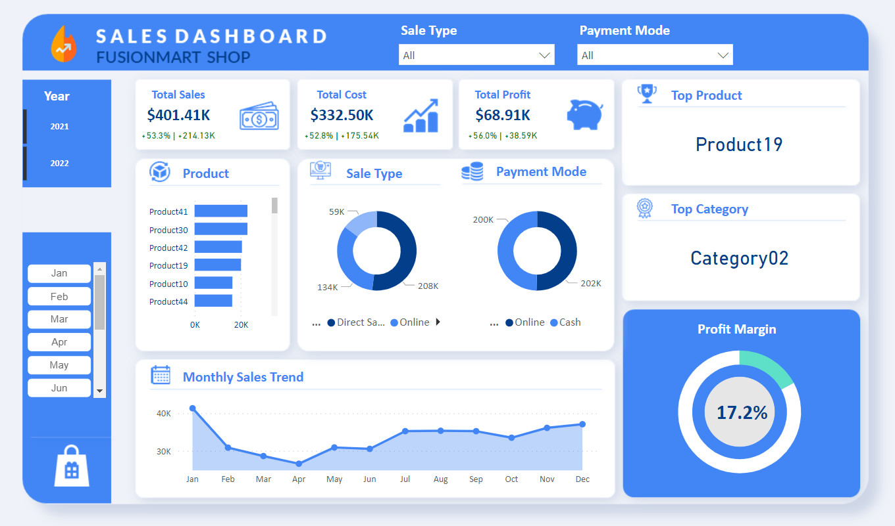

# Sales Analysis and Visualization for FusionMart Store


## Introduction

FusionMart is an imaginary retail company that specializes in selling various products across different categories. The company has been operating for a few years and has gathered a considerable amount of sales data. In order to optimize its sales strategies and identify areas for improvement, FusionMart has contracted me, an Analytics consultant, to conduct a comprehensive sales analysis and visualization project.

## Problem Statement

Because this is a hypothetical case study, I had to come up with the business questions from my critical thinking skills based on the provisions in the dataset.

The following questions need to be answered:
- What is the overall total sales volume and profit?
- What is the top product in terms of sales revenue?
- What is the top-selling category in terms of sales volume?
- How do different sale types impact overall sales performance?
- What is the distribution of sales across various payment modes?
- Which months or periods experience the highest and lowest sales volumes?
- What is the profit margin over time?

## Data Sourcing

I came across the data online and saved locally on my PC in Excel Workbook format. Considering how rich the data was, I decided to implement my analytics skill on the dataset. The dataset is a single Excel workbook which contains 2 tables or worksheets namely; `InputData` and `MasterData`. The `InputData` table has 527 rows and 6 columns, while the `MasterData` table contains 45 rows and 6 columns.

## Data Cleaning & Transformation

I performed thorough data cleaning in the Power Query tool of Power BI.
The processes include:
- Checking for null values
- Validating data types
- Merging of tables and rename new consolidated table as `SalesData`
- Checking for duplicates in the distinct columns
- Creating a Calendar table which contains new Date using 'Mashup Query language' for the purpose of time intelligence analysis. 
I utilized the following code in creating the Calendar table: 

```
 = {Number.From(List.Min(SalesData[DATE]))..Number.From(List.Max(SalesData[DATE]))}
 ```
## Data Modeling

The `Calendar` table was connected to the fact table, `SalesData`, via the common columns respectively. A star schema model (1:*) relationship was established.



## Data Analysis Expression (DAX) Concepts

I used the DAX language to calculate several explicit measures including:
- Total Cost
- Total Sales
- Profit 
- KPI Sales vs Last year
- KPI Cost vs Last year
- KPI Profit vs Last year
- Sales_YoY%, and others.

## Data Visualization & Analysis

I designed a custom layout in PowerPoint for the canvas background in order to enhance the beauty of the report's dashboard.

**The key performance indicators I added include:**
- Total Sales (2021-2022)
- Total Cost (2021-2022)
- Total Profit (2021-2022)

I created KPI measures which measure the total of each KPI against the previous year-to-date. 



You can interact with the report by [clicking here](https://app.powerbi.com/view?r=eyJrIjoiYzJmZTkxYTEtNmEwNC00OWNiLWEyMTEtNDA5MWY5OTY2NjRkIiwidCI6ImZkMjljODFlLWI1YzUtNDAzNS1hZGIyLTBmMGJjODhiMzM2NyJ9)

## Analysis (Insights)

1. The total sales volume was $401.41K while the total profit was $68.91K 

2. The top product in terms of sales revenue is dynamic according to selected metrics, however, the overall top product was "Product19"

3. The top-selling category in terms of sales volume is dynamic according to selected metrics, however, the overall top category was "Category02"

4. Distribution of sales according to Sale Type:
- Direct sales = $208.14K
- Online = $133.92K
- Wholesaler = $59.35K
Among the different sale types, Direct sales impacted overall sales performance.

5. According to the different payment modes, 'Online' accounted for $201.90K sales while 'Cash' generated a total sale of $199.52K.

6. The month which experienced the highest sales volume (2021-2022) was January, with the total sales of $41.35K, while April account for the lowest sale of $26.58K.

In considering separate years, October, 2021 accounted for $20.45K sales (highest), while May 2021 gave $7.96K sales (lowest). In 2022, November generated the highest sale of $26.42K, but, April brought in the lowest sales of the amount of $11.33K.

7. The profit margin over time was 17.2%

## Conclusion/ Recommendations:
- Focus on optimizing inventory and marketing efforts for the consistently top-performing product and the top category.
- Prioritize and invest in direct sales strategies, as they significantly impact overall sales performance.
- Enhance the online purchasing experience to capitalize on the dominance of the 'Online' payment mode.
- Plan targeted marketing campaigns and promotions around peak sales periods.
- Adapt sales strategies to seasonal variations and market dynamics to maximize sales opportunities.
- With a profit margin of 17.2%, FusionMart demonstrates a healthy level of profitability. However, there may be opportunities to increase efficiency and reduce costs to further improve profitability.
***

###### My goal is to provide value to the stakeholders and not just to build reports and dashboard.
#### Thank you.
